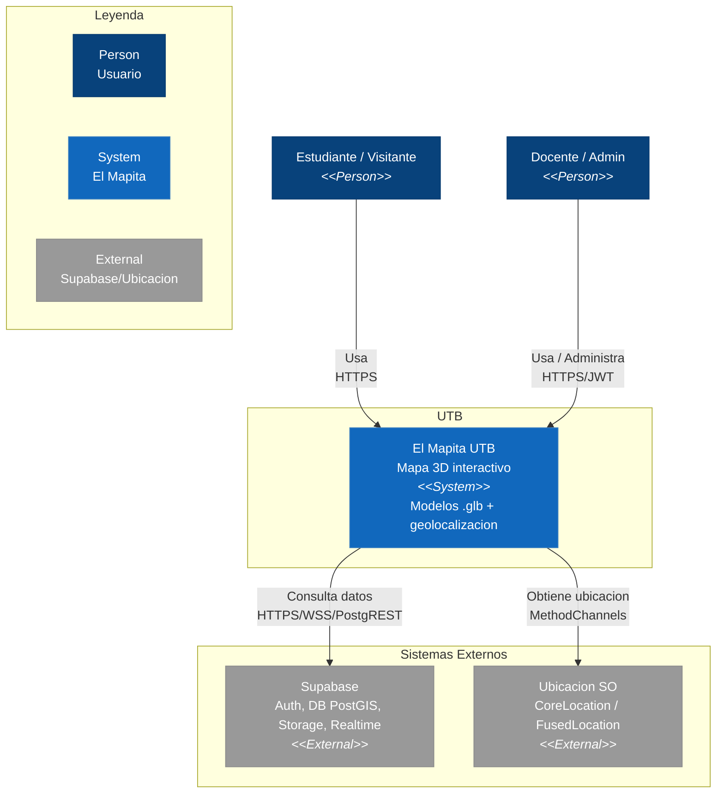

# C4 Nivel 1 — Diagrama de Contexto del Sistema — El Mapita UTB

> Referencia: [C4 Model: Documentación Clara y Efectiva](https://dev.to/ajcastillo/c4-model-documentacion-clara-y-efectiva-para-arquitecturas-de-software-43od) — Nivel 1 responde *¿Dónde encaja este sistema dentro del ecosistema?* Dirigido a stakeholders no técnicos.  
> Fuente: `docs/arc42/arc42-template-EN.md` S3.1/S3.2 | Render: [`C4_L1_Context.png`](./C4_L1_Context.png)

## Diagrama (Mermaid)

## Actores y Sistemas

| Elemento | Tipo |
|----------|------|
| Estudiante / Visitante | Person |
| Docente / Admin | Person |
| El Mapita UTB | System (UTB) |
| Supabase | System_Ext |
| Ubicacion SO | System_Ext |
