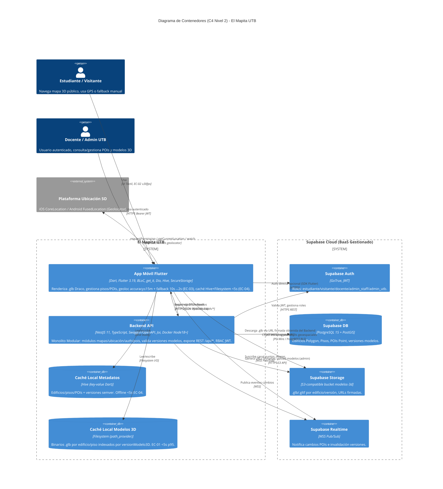

# C4 Nivel 2 — Diagrama de Contenedores — El Mapita UTB

> Referencia: [C4 Model: Documentación Clara y Efectiva](https://dev.to/ajcastillo/c4-model-documentacion-clara-y-efectiva-para-arquitecturas-de-software-43od) — Nivel 2 responde *¿Cuáles son los contenedores principales? ¿Cómo se comunican? ¿Qué tecnologías?* Dirigido a equipos técnicos y gerentes de proyecto.  
> Fuente: `docs/arc42/arc42-template-EN.md` S5.1/S5.2/S7 | Render: [`C4_L2_Container.png`](./C4_L2_Container.png) | Estilo: **DEC-01 Monolito Modular** (NestJS + Flutter)

## Diagrama (Mermaid — C4Container)

## Contenedores

| Contenedor | Tipo | Stack | Responsabilidad | EC / RES |
|------------|------|-------|-----------------|----------|
| App Móvil Flutter | Container (cliente) | Flutter 3.19, BLoC, Dio, get_it, Hive, SecureStorage, geolocator | `features/mapas` (MapasBloc, ModelCache), `features/ubicacion` (UbicacionBloc) | EC-01/02/03/04, RES-02/03 |
| Backend API | Container (servidor) | NestJS 11, Swagger, Joi, Docker | `modules/mapas/pois/auth/ubicacion` + `HealthController /health` + `shared/kernel` | S4 tácticas |
| Caché Local Metadatos | ContainerDb | Hive | POIs/edificios/pisos versionados semver | EC-04 <5s offline |
| Caché Local Modelos 3D | ContainerDb | Filesystem | `.glb` Draco por `versionModelo3D` | EC-01 <5s p95 |
| Supabase Auth | Container (externo) | GoTrue | JWT, roles `estudiante/visitante/docente/admin_staff/admin_utb` | S3.2 Media |
| Supabase DB | ContainerDb (externo) | PostgreSQL 15 + PostGIS | Building Polygon, Floor, Poi Point | S3.2 Alta |
| Supabase Storage | Container (externo) | S3 bucket `modelos-3d` | Artefactos 3D firmados | S3.2 Alta |
| Supabase Realtime | Container (externo) | WSS | Invalidación caché, cambios POIs | S3.2 Baja/Media |
| Plataforma Ubicación SO | System_Ext | CoreLocation/FusedLocation | accuracy, permisos, stream | RES-02, EC-03 |

## Decisiones visibles

* **DEC-01 Monolito Modular** — un deploy backend + un binary móvil; fronteras por feature.
* **DEC-02 Desacoplo Supabase** — SDK solo en `infrastructure/adapters`; dominio con `Repository` fakes.
* **DEC-04 Caché 2 niveles** — Hive + Filesystem versionados, recuperación offline sin backend.
