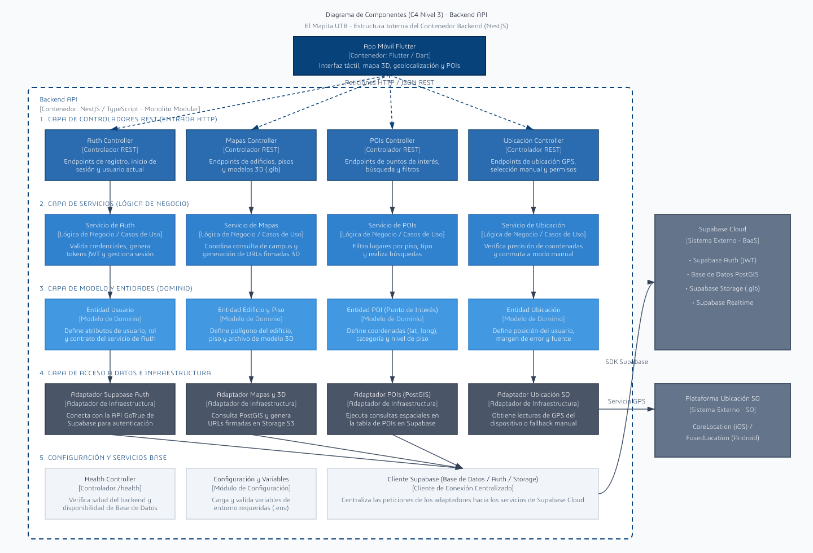

# C4 Nivel 3 — Diagrama de Componentes — Backend API

> **Propósito**: Expandir el contenedor **Backend API** (NestJS) definido en el C4 Nivel 2, detallando la organización interna por módulos funcionales (`Auth`, `Mapas`, `POIs`, `Ubicación`) y capas arquitectónicas sencillas y claras para el ámbito escolar (Controladores REST $\rightarrow$ Servicios de Negocio $\rightarrow$ Entidades $\rightarrow$ Adaptadores de Datos).

---

## Diagrama de Componentes

---

## Mapeo de Componentes al Código del Proyecto (`backend/src`)

| Componente del Diagrama | Ruta en el Código | Descripción Sencilla |
| :--- | :--- | :--- |
| **Auth Controller** | `backend/src/modules/auth/interfaces/auth.controller.ts` | Recibe las peticiones HTTP para inicio de sesión y registro. |
| **Servicio de Auth** | `backend/src/modules/auth/application/use-cases.ts` | Procesa la autenticación y la validación de tokens. |
| **Entidad Usuario** | `backend/src/modules/auth/domain/index.ts` | Estructura de datos del usuario y sus roles. |
| **Adaptador Supabase Auth** | `backend/src/modules/auth/infrastructure/supabase/supabase-auth-client.ts` | Conector con el servicio de autenticación de Supabase. |
| **Mapas Controller** | `backend/src/modules/mapas/interfaces/mapas.controller.ts` | Entrega información de edificios, pisos y archivos 3D. |
| **Servicio de Mapas** | `backend/src/modules/mapas/application/use-cases.ts` | Organiza los mapas y genera enlaces de descarga para modelos `.glb`. |
| **Entidad Edificio y Piso** | `backend/src/modules/mapas/domain/index.ts` | Representa la geometría de los edificios y los niveles del campus. |
| **Adaptador Mapas y 3D** | `backend/src/modules/mapas/infrastructure/persistence/supabase-repositories.ts` / `backend/src/modules/mapas/infrastructure/storage/supabase-storage.ts` | Lee los datos geográficos de PostGIS y archivos de Supabase Storage. |
| **POIs Controller** | `backend/src/modules/pois/interfaces/pois.controller.ts` | Expone los puntos de interés para la aplicación móvil. |
| **Servicio de POIs** | `backend/src/modules/pois/application/use-cases.ts` | Filtra puntos de interés según el piso o la búsqueda del usuario. |
| **Entidad POI** | `backend/src/modules/pois/domain/index.ts` | Define las coordenadas, nombre y tipo de cada punto de interés. |
| **Adaptador POIs (PostGIS)** | `backend/src/modules/pois/infrastructure/supabase-poi-repository.ts` | Realiza las búsquedas en la base de datos de Supabase. |
| **Ubicación Controller** | `backend/src/modules/ubicacion/interfaces/ubicacion.controller.ts` | Recibe la posición GPS o la ubicación manual indicada por el usuario. |
| **Servicio de Ubicación** | `backend/src/modules/ubicacion/application/use-cases.ts` | Controla el margen de error GPS y habilita el cambio a modo manual. |
| **Entidad Ubicación** | `backend/src/modules/ubicacion/domain/index.ts` | Representa las coordenadas y precisión de la posición actual. |
| **Adaptador Ubicación SO** | `backend/src/modules/ubicacion/infrastructure/platform/location-adapter.ts` | Conecta con los sensores GPS del teléfono. |
| **Health Controller** | `backend/src/health.controller.ts` | Endpoint directo `/health` para comprobar que el sistema está activo. |
| **Configuración y Variables** | `backend/src/shared/config/config.module.ts` | Carga los parámetros del archivo de configuración `.env`. |
| **Cliente Supabase** | `backend/src/shared/supabase/client.ts` | Centraliza la conexión con los servicios en la nube de Supabase. |
