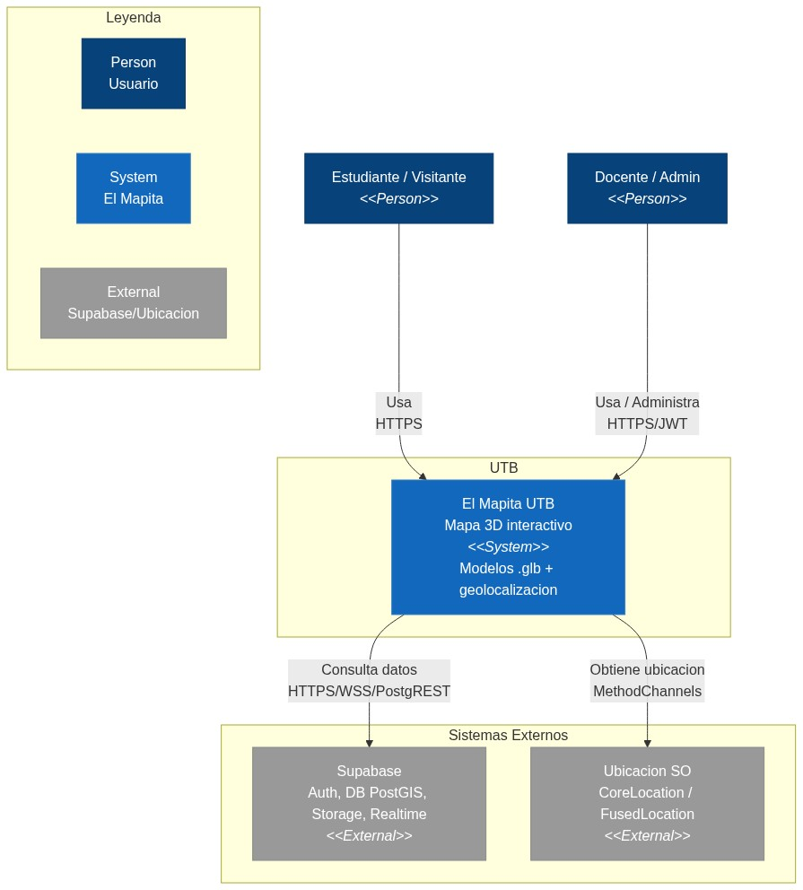
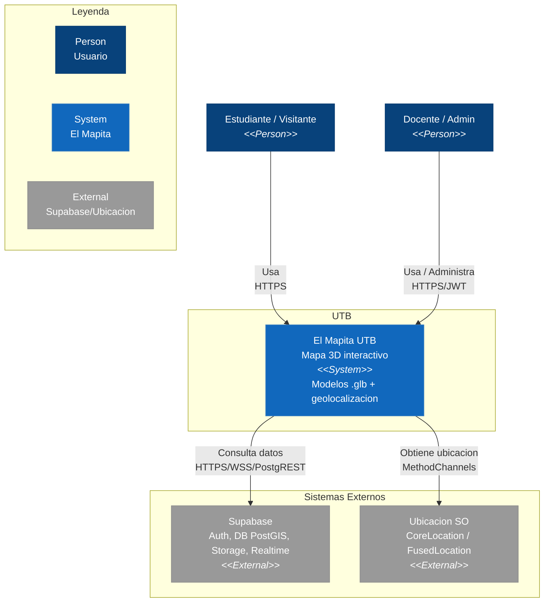
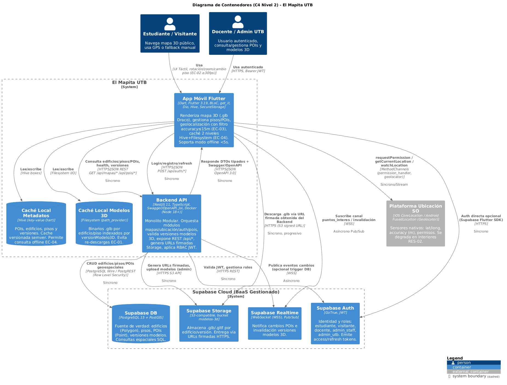
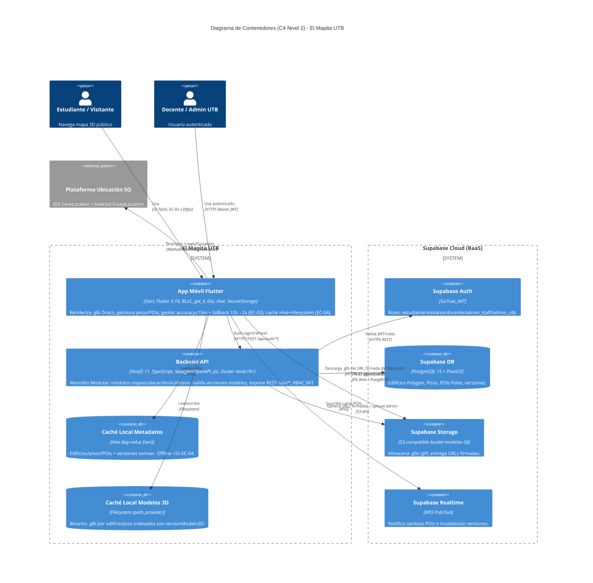

# C4 Model — El Mapita UTB (Niveles 1 y 2)

> Referencia metodológica: [C4 Model: Documentación Clara y Efectiva para Arquitecturas de Software](https://dev.to/ajcastillo/c4-model-documentacion-clara-y-efectiva-para-arquitecturas-de-software-43od) — Aj Castillo (DEV.to).  
> Trazabilidad: `docs/arc42/arc42-template-EN.md` S3 (Contexto) y S5 (Bloques), `docs/comparativa-de-arquitecturas.md`.

---

## Convenciones

| Nivel | Pregunta clave (artículo) | Interlocutores | Qué muestra |
|-------|---------------------------|----------------|-------------|
| **N1 Contexto** | *¿Dónde encaja este sistema dentro del ecosistema?* | Stakeholders no técnicos, gerencia, soporte | Actores + sistema + sistemas externos |
| **N2 Contenedor** | *¿Cuáles son los contenedores principales? ¿Cómo se comunican? ¿Qué tecnologías?* | Equipos técnicos y gerentes de proyecto | Apps, servicios, BDs y sus protocolos |

Fuentes generativas: **Mermaid C4** (`.md` con `C4Context`/`C4Container`) → render nativo GitHub + export PNG. Solo se conserva PNG como artefacto binario.

---

## Nivel 1 — Diagrama de Contexto del Sistema

Define los límites de **El Mapita UTB**, sus actores humanos y los sistemas externos (Supabase BaaS y plataforma de ubicación del SO). Monolito Modular `NestJS + Flutter` encapsulado como un único `System`.

### Archivos

| Artefacto | Ruta |
|-----------|------|
| Mermaid fuente | [`C4_L1_Context.md`](./C4_L1_Context.md) |
| Render PNG | [`C4_L1_Context.png`](./C4_L1_Context.png) |
| Legacy PNG (pre-existente) | [`C4_Contexto.png`](./C4_Contexto.png) |

### Render estático



### Diagrama en Mermaid — Texto mínimo, 2 actores, externos debajo de UTB (estilo C4 con notación estándar)



### Descripción de elementos (Nivel 1)

| Elemento | Tipo |
|----------|------|
| Estudiante / Visitante | Person |
| Docente / Admin | Person |
| El Mapita UTB | System (UTB) |
| Supabase | System_Ext |
| Ubicacion SO | System_Ext |

> Detalle completo de roles y responsabilidades: `C4_L1_Context.md` (mermaid) y `arc42 S3.1/S3.2`.

---

## Nivel 2 — Diagrama de Contenedores

Desglosa **El Mapita UTB** en contenedores desplegables, sus tecnologías y protocolos. Responde a las preguntas del artículo: *contenedores, comunicación y stack por contenedor*. Mantiene la decisión **DEC-01 Monolito Modular**.

### Archivos

| Artefacto | Ruta |
|-----------|------|
| Mermaid fuente | [`C4_L2_Container.md`](./C4_L2_Container.md) |
| Render PNG | [`C4_L2_Container.png`](./C4_L2_Container.png) |

### Render estático



### Diagrama en Mermaid (C4Container)



### Tabla de contenedores

| Contenedor | Tipo | Stack | Responsabilidad | EC / RES |
|------------|------|-------|-----------------|----------|
| **App Móvil Flutter** | Container (cliente) | Flutter, BLoC, Dio, get_it, Hive, SecureStorage, geolocator | `features/mapas` (MapasBloc, ModelCache), `features/ubicacion` (UbicacionBloc, LocationService) | EC-01/02/03/04, RES-02/03 |
| **Backend API** | Container (servidor) | NestJS, TypeScript, Swagger, Joi, `shared/kernel/errors/config/supabase` | `modules/mapas/pois/auth/ubicacion` (domain/application/infrastructure/interfaces), `HealthController /health` | S4 tácticas |
| **Caché Local Metadatos** | ContainerDb | Hive | POIs/edificios/pisos versionados | EC-04 (<5s offline) |
| **Caché Local Modelos 3D** | ContainerDb | Filesystem | `.glb` Draco por `versionModelo3D` | EC-01 (<5s p95) |
| **Supabase Auth** | Container (externo) | GoTrue | JWT, roles `estudiante/visitante/docente/admin_staff/admin_utb` | S3.2 Media |
| **Supabase DB** | ContainerDb (externo) | PostgreSQL+PostGIS | `Building {Polygon}`, `Floor`, `Poi {Point}` | S3.2 Alta |
| **Supabase Storage** | Container (externo) | S3 bucket `modelos-3d` | Artefactos 3D firmados | S3.2 Alta |
| **Supabase Realtime** | Container (externo) | WSS | Invalidación caché, cambios POIs | S3.2 Baja/Media |
| **Plataforma Ubicación SO** | System_Ext | CoreLocation/FusedLocation | `accuracy`, permisos, stream | RES-02, EC-03 |

### Decisiones visibles en el diagrama

* **DEC-01 Monolito Modular** — un solo deploy backend + un solo binary móvil; fronteras por feature (`modules/*`, `features/*`), `shared kernel` mínimo (`backend/src/shared:15`, `frontend/lib/core:12`).
* **DEC-02 Desacoplo Supabase** — SDK solo en `infrastructure/adapters`; dominio usa `BuildingRepository/FloorRepository/PoiRepository/LocationProvider` (fakes en tests EC-03).
* **DEC-04 Caché 2 niveles** — Hive + Filesystem versionados, recuperación offline directa desde `mobileApp` sin pasar por `backendApi` cuando `DioClient` falla.

---

## Cómo regenerar los diagramas

Los diagramas fuente son **Mermaid** (`.md`). El PNG se genera exportando el bloque `C4Context`/`C4Container` con cualquier renderer Mermaid (ej. [Mermaid Live Editor](https://mermaid.live), `mermaid-cli` o `Kroki`):

```bash
# Opción A — mermaid-cli (recomendado, solo PNG)
npx -y @mermaid-js/mermaid-cli -i docs/c4/C4_L1_Context.md -o docs/c4/C4_L1_Context.png
npx -y @mermaid-js/mermaid-cli -i docs/c4/C4_L2_Container.md -o docs/c4/C4_L2_Container.png

# Opción B — Kroki (sin instalación)
curl -X POST https://kroki.io/mermaid/png --data-binary @docs/c4/C4_L1_Context.md -H "Content-Type: text/plain" -o docs/c4/C4_L1_Context.png
```

---

## Trazabilidad

* **Contexto de negocio** `arc42 S3.1` → actores del Nivel 1.
* **Contexto técnico** `arc42 S3.2` → sistemas externos y criticidad.
* **Bloques Nivel 1** `arc42 S5.1` y **S5.2** → mapeo directo a contenedores del Nivel 2.
* **Escenarios** `arc42 S6.1/6.2/6.3` → flujos que atraviesan `mobileApp ↔ backendApi ↔ Supabase* ↔ localCache* ↔ osLocation`.
